# Alethian System Diagrams

This document contains the architectural and design diagrams for the Alethian Local-First Research Integrity System, based on the SRS Version 1.0.

## 1. System Architecture Diagram
This diagram illustrates the high-level architecture of Alethian, highlighting the separation between the execution environment (Institutional Server), the client interface, and the transient external API mesh.

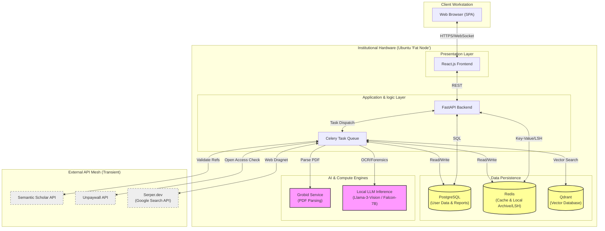

---

## 2. Data Flow Diagrams (DFD)

### 2.1 Level 0 DFD (Context Diagram)
The highest-level view of the system, showing the interaction between the core actors and the Alethian system.

```mermaid
graph LR
    User(Faculty / Reviewer)
    System[Alethian System]
    ExtAPIs[External API Mesh\n(Semantic Scholar, Unpaywall, Serper)]
    LocalDocs[Local Document Archive]

    User -->|Upload PDF| System
    User -->|Request Report| System
    System -->|Validation Report| User
    System -->|Real-time Status| User

    System <-->|Query Citation/Web Data| ExtAPIs
    System <-->|Compare against History| LocalDocs
```

### 2.2 Level 1 DFD (System Overview)
Expands the system process into its major logical pipeline stages.

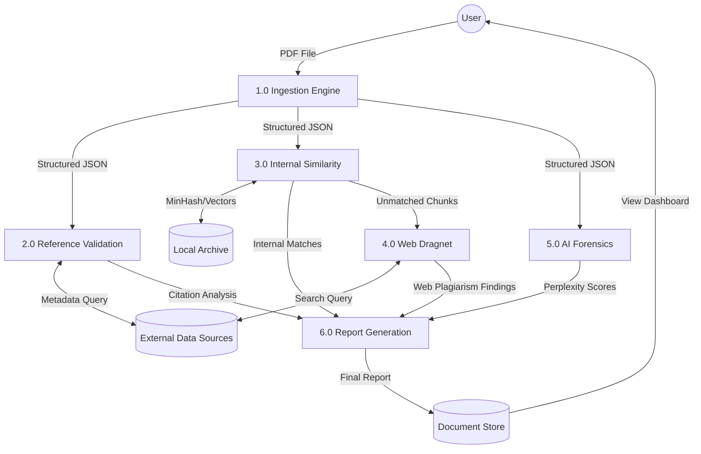

### 2.3 Level 2 DFD: Layer 1 (The Ingestion Engine)
Detailed flow of the PDF processing and structural extraction.

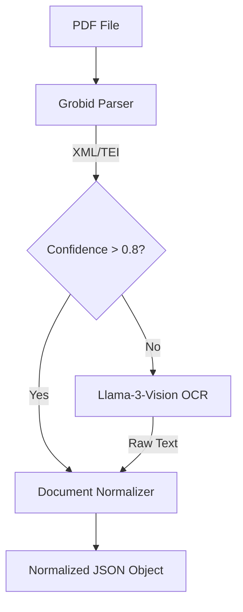

### 2.4 Level 2 DFD: Layer 2 (Reference Validation)
The API Mesh workflow for verifying citations.

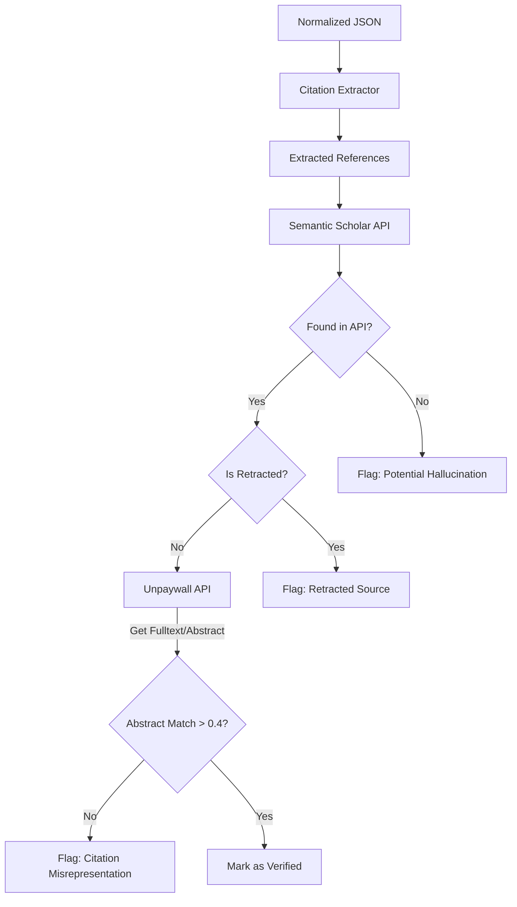

### 2.5 Level 2 DFD: Layer 3 (Internal Similarity)
Local plagiarism detection against institutional archives.

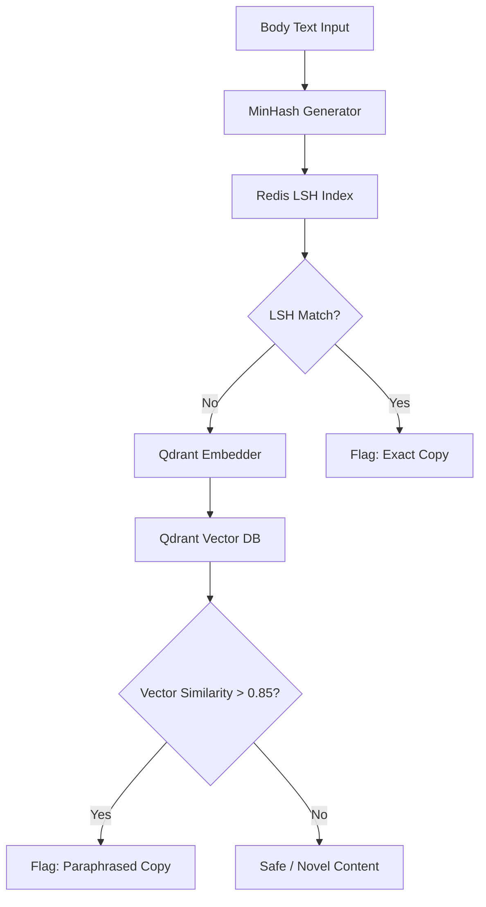

### 2.6 Level 2 DFD: Layer 4 (Web Dragnet)
Targeted web search for systematic plagiarism.

```mermaid
graph TD
    SafeText[Text (Passed Layer 3)]
    Chunker[Suspicious Chunker]
    Serper[Serper.dev API]
    Results[Search Results]
    Coherence[Source Coherence Analyzer]
    
    Threshold{>3 Chunks from Same Domain?}
    FlagWeb[Flag: Systematic Web Plagiarism]
    Clean[No Action]

    SafeText --> Chunker
    Chunker -->|Low Perplexity Chunks| Serper
    Serper --> Results
    Results --> Coherence
    Coherence --> Threshold
    
    Threshold -- Yes --> FlagWeb
    Threshold -- No --> Clean
```

### 2.7 Level 2 DFD: Layer 5 (AI Forensics)
Statistical analysis for AI-generated text detection.

```mermaid
graph TD
    Text[Body Text]
    Tokenizer[Tokenizer]
    Llama[Llama-3 (Observer)]
    Falcon[Falcon-7B (Performer)]
    
    Metric[Calculate Binoculars Metric]
    Stats[Calculate Burstiness & Perplexity]
    
    Viz[Generate Plots]
    Report[Forensic Layer Report]

    Text --> Tokenizer
    Tokenizer --> Llama
    Tokenizer --> Falcon
    
    Llama --> Metric
    Falcon --> Metric
    
    Metric --> Viz
    Text --> Stats
    Stats --> Viz
    Viz --> Report
```

---

## 3. Entity-Relationship Diagram (ERD)
This diagram models the data entities stored in PostgreSQL and their diverse relationships.

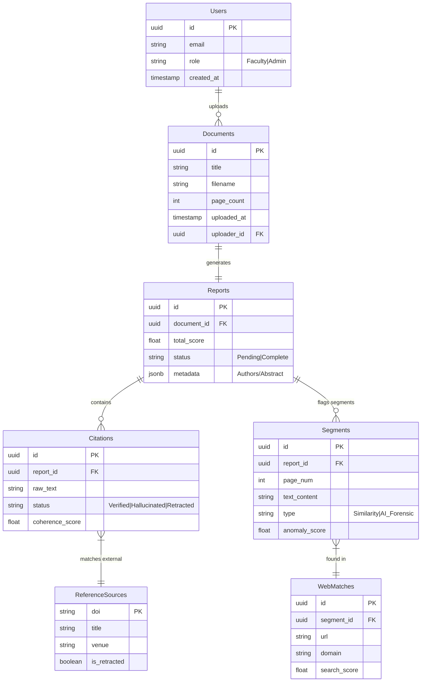

---

## 4. Use Case Diagrams
Visualizes the functional interactions of different user actors with the system.

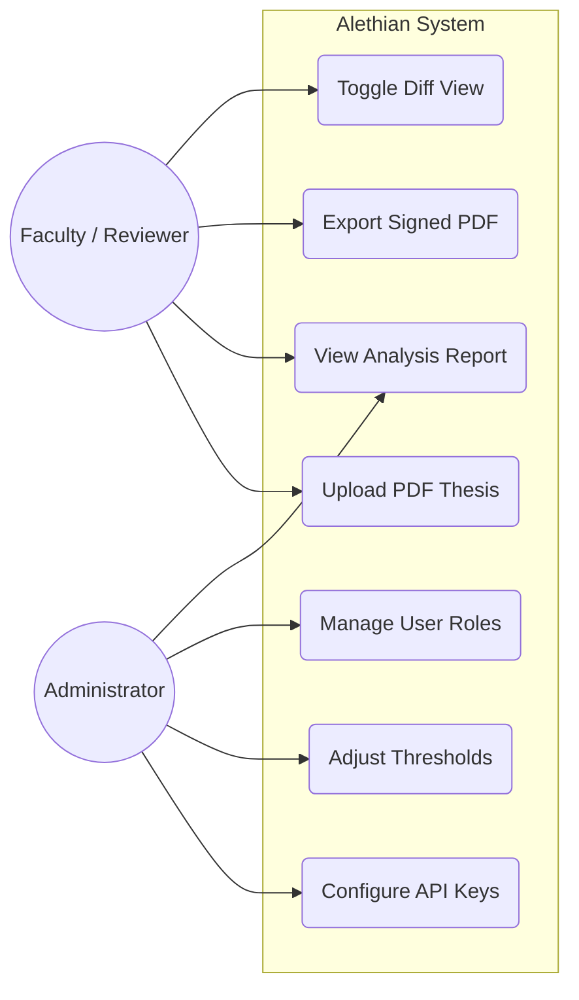

---

## 5. Sequence Diagrams

### 5.1 Scenario 1: Full Submission Pipeline
The orchestration of the multi-stage analysis pipeline upon document submission.

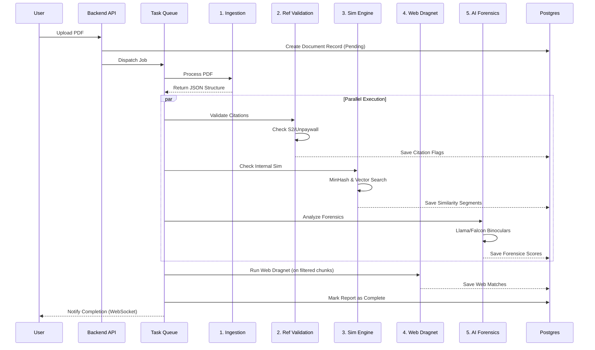

### 5.2 Scenario 2: Faculty Report Review & Export
The workflow for a reviewer analyzing a report and generating a visual summary.

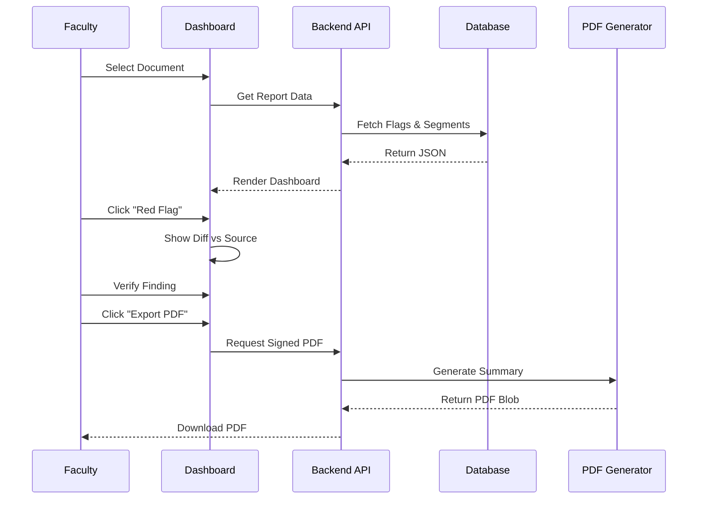

### 5.3 Scenario 3: Ingestion Fallback Handling
The fallback mechanism when Grobid fails to parse a scanned document.

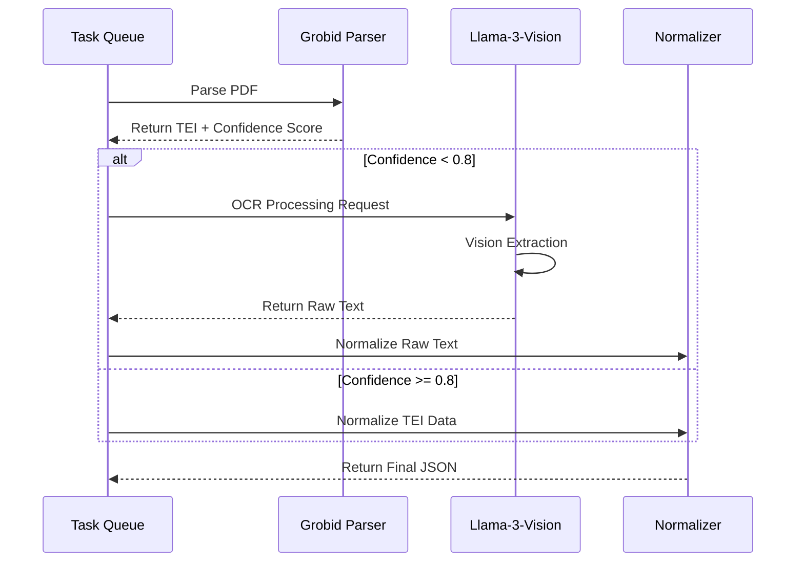

### 5.4 Scenario 4: Admin Configuration
Administrative updates to system configuration.

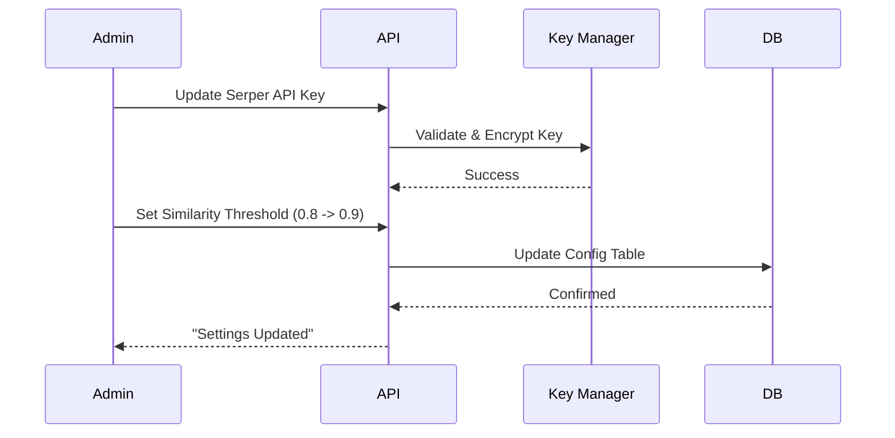

---

## 6. Class Diagrams
The static structure of the system's core components and logic classes.

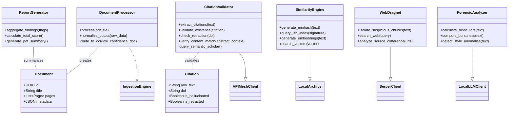

---

## 7. Deployment Diagram
Illustrates the physical deployment view, emphasizing the containerized services orchestrated via Docker Compose on the institutional server.

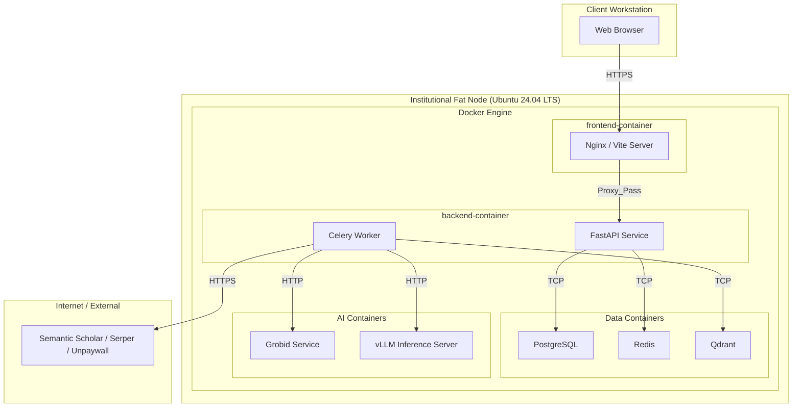
