# Alethian System Diagrams v2.0 (Mermaid)

This document contains the architectural and design diagrams for the Alethian v2 Plagiarism Detection System, using Mermaid syntax for rich rendering.

## 1. System Architecture Diagram

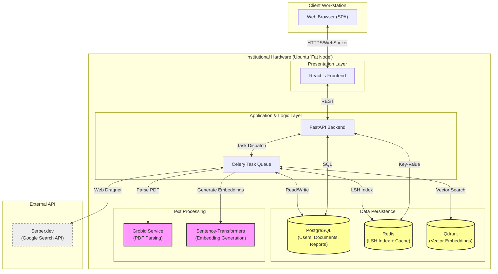

---

## 2. Data Flow Diagrams (DFD)

### 2.1 Level 0 DFD (Context Diagram)

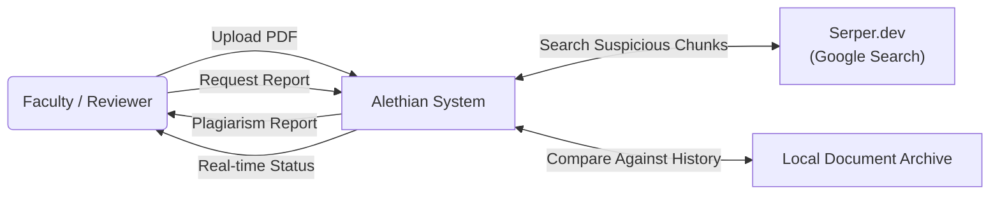

### 2.2 Level 1 DFD (System Overview)

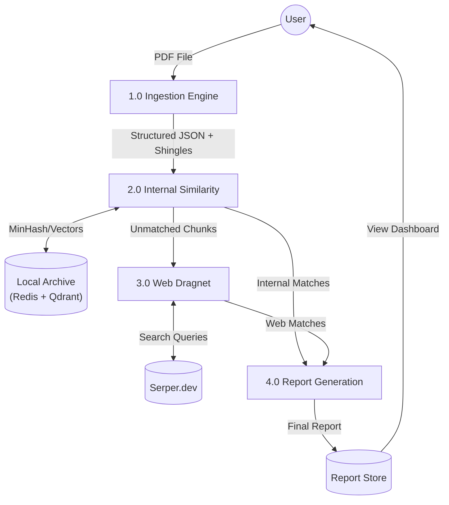

### 2.3 Level 2 DFD: Layer 1 (The Ingestion Engine)

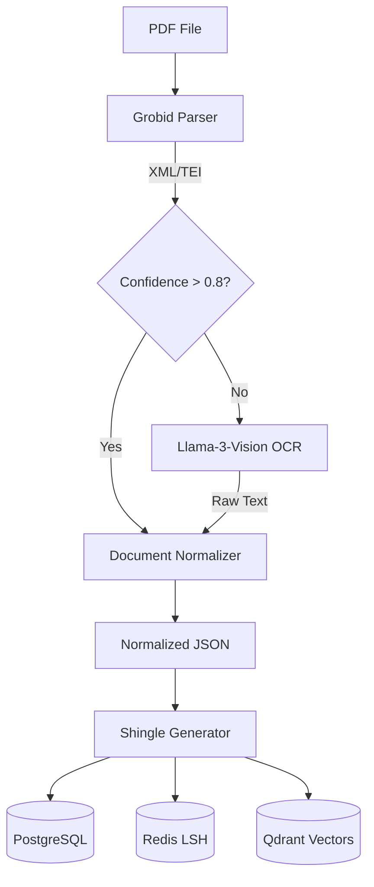

### 2.4 Level 2 DFD: Layer 2 (Internal Similarity)

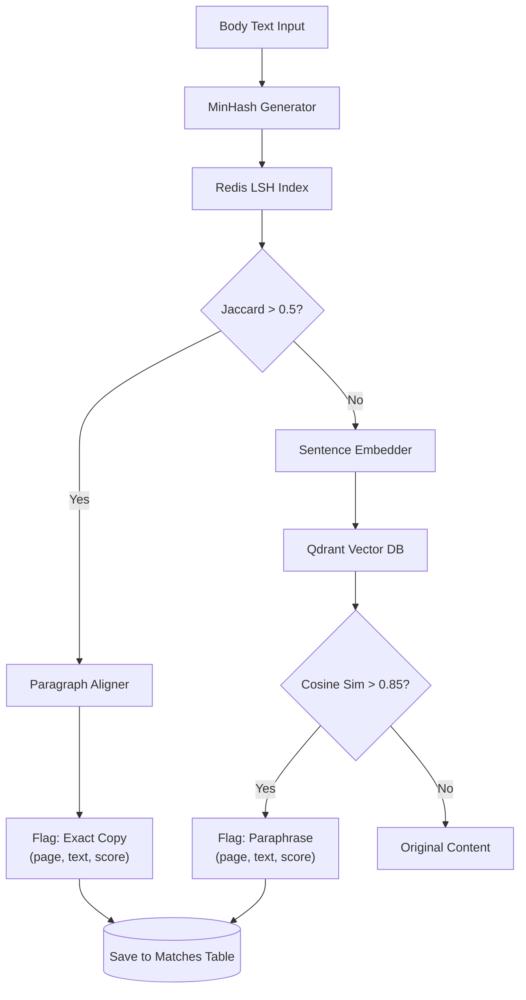

### 2.5 Level 2 DFD: Layer 3 (Web Dragnet)

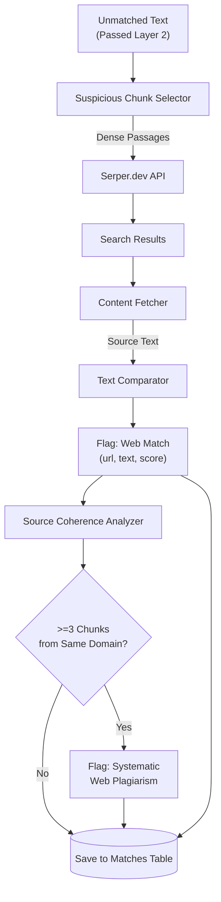

### 2.6 Report Generation Flow

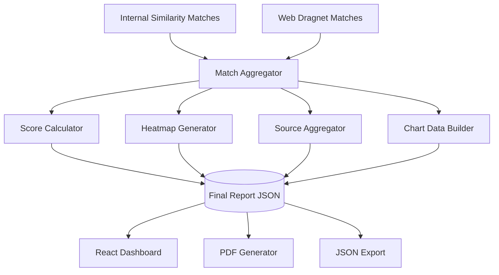

---

## 3. Entity-Relationship Diagram (ERD)

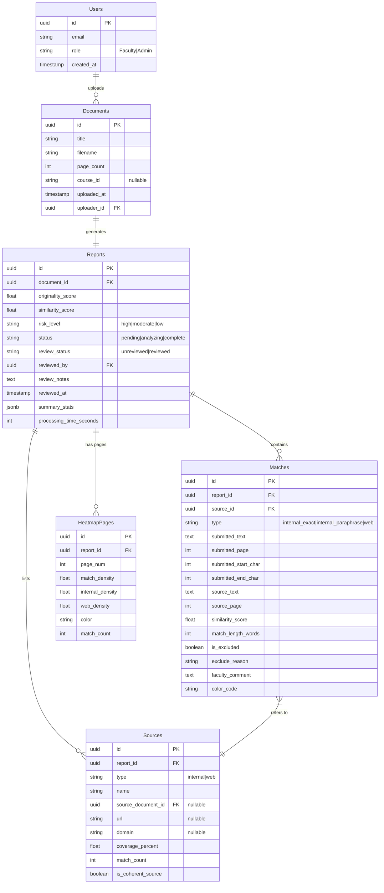

---

## 4. Use Case Diagram

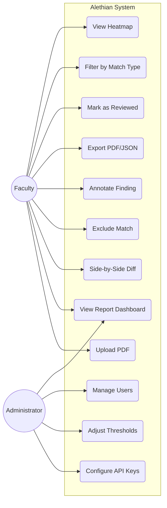

---

## 5. Sequence Diagrams

### 5.1 Full Submission Pipeline

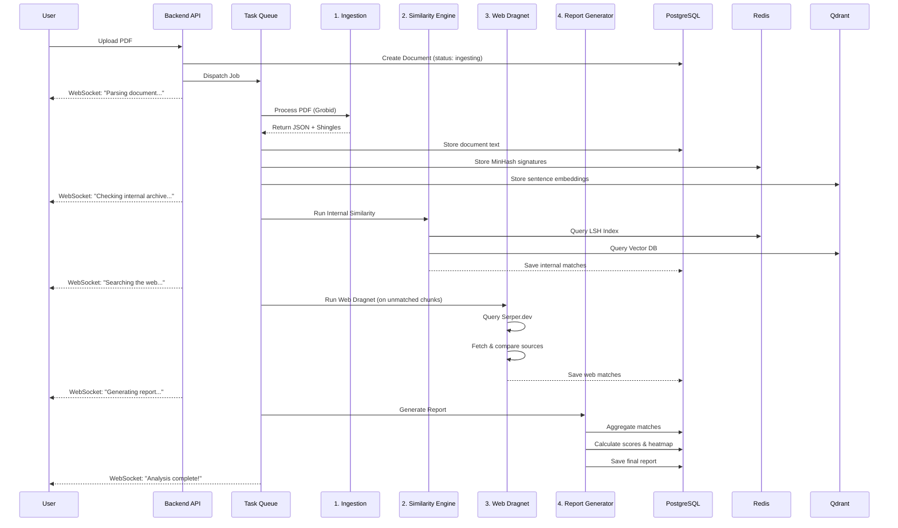

### 5.2 Faculty Report Interaction

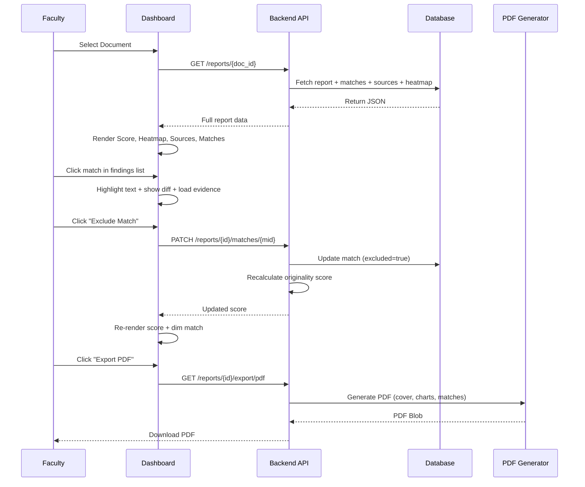

### 5.3 Ingestion Fallback

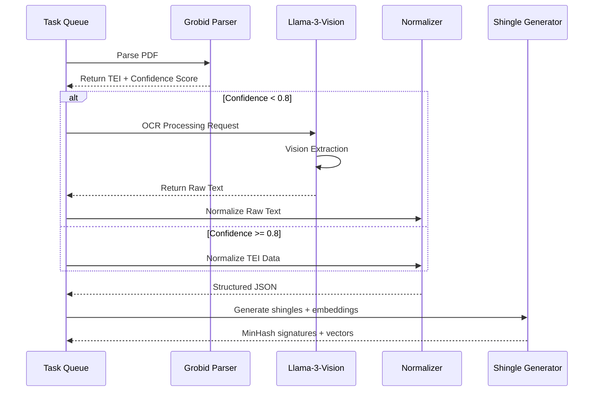

---

## 6. Class Diagram

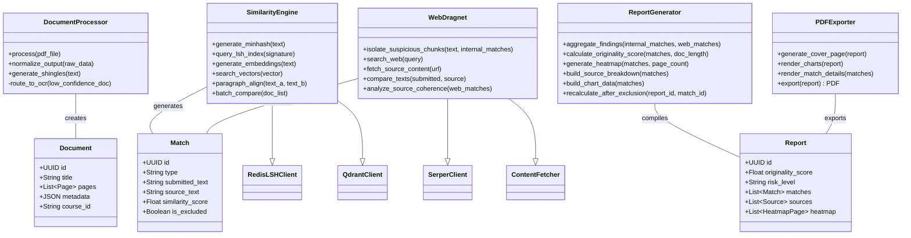

---

## 7. Deployment Diagram

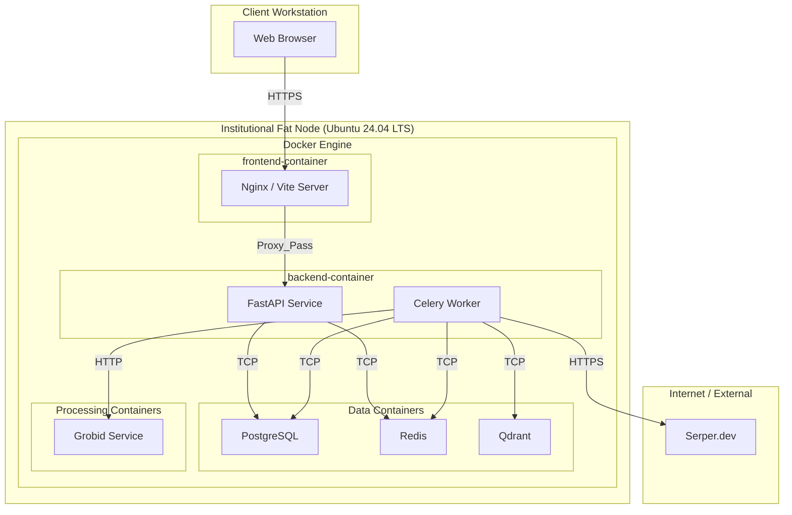
