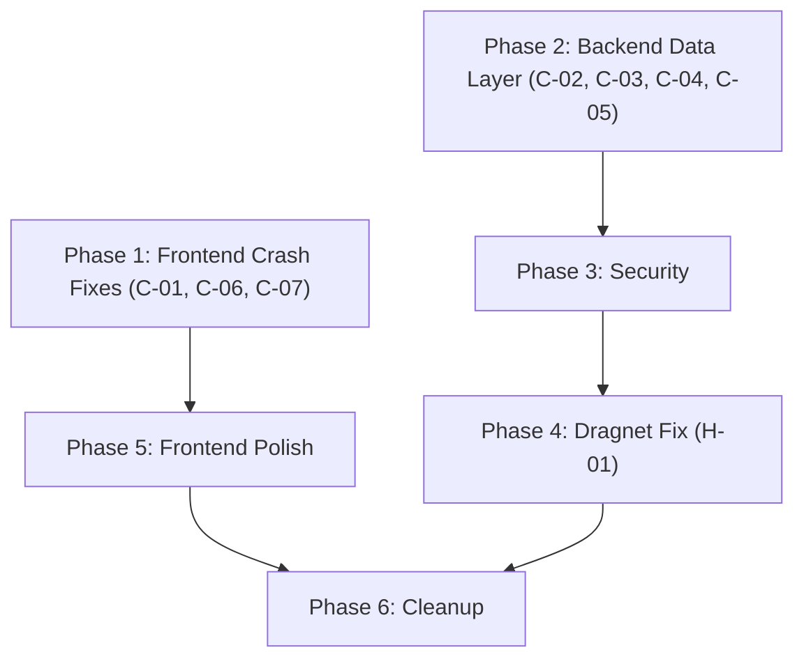

# Alethian V2 — Remediation Plan for All 38 Audit Findings

**Date:** 2026-04-09  
**Scope:** Fix every finding from the V3 Audit Report  
**Approach:** 6 dependency-ordered phases — each phase unlocks the next  
**Estimated Total Effort:** ~4-5 hours

---

## Phase Dependencies



> [!IMPORTANT]
> Phase 1 and Phase 2 are independent and can be worked in parallel. Phase 1 fixes the frontend crashes. Phase 2 fixes the backend data layer. Both must complete before Phase 5/6.

---

## Phase 1: Frontend Critical Crash Fixes

**Fixes:** C-01, C-06, C-07  
**Goal:** The application renders without JavaScript errors.  
**Effort:** ~15 minutes

---

### 1.1 [MODIFY] `frontend/src/components/report/MatchCard.jsx`

**Fixes:** C-01 (missing function declaration — broken component)

The file is missing the `export default function` wrapper and the `useParams` destructuring. The entire component body is orphaned code.

```diff
 import { useReportStore } from '../../stores/reportStore';
 import { AlertCircle, FileText, Globe } from 'lucide-react';
 import Client from '../../api/client';
 import { useParams } from 'react-router-dom';
-    const { setSelectedMatch, selectedMatchId } = useReportStore();
+
+export default function MatchCard({ match }) {
+    const { id } = useParams();
+    const { setSelectedMatch, selectedMatchId } = useReportStore();
```

Also remove the unused `AlertCircle` import:
```diff
-import { AlertCircle, FileText, Globe } from 'lucide-react';
+import { FileText, Globe } from 'lucide-react';
```

---

### 1.2 [MODIFY] `frontend/src/pages/ReportView.jsx`

**Fixes:** C-06 (React Hook called after conditional return)

Move the `useReportStore()` hook call **before** the conditional returns:

```diff
 export default function ReportView() {
     const { id } = useParams();
     const navigate = useNavigate();
     const { report, loading } = useReport(id);
+    const { selectedMatchId } = useReportStore();
 
     if (loading) return <div className="flex items-center justify-center h-screen text-gray-500">Loading Report...</div>;
     if (!report) return <div className="flex items-center justify-center h-screen">Report not found</div>;
 
     const matches = report.matches || [];
-    const { selectedMatchId } = useReportStore();
     const selectedMatch = matches.find(m => m.id === selectedMatchId) || matches[0];
```

---

### 1.3 [MODIFY] `frontend/src/pages/Dashboard.jsx`

**Fixes:** C-07 (response object used as array)

The API returns `{total, items}` but the code stores the whole object:

```diff
     const loadDocuments = async () => {
         try {
             const docs = await Client.documents.list({ course_id: courseFilter || undefined });
-            setDocuments(docs);
+            setDocuments(docs.items || docs || []);
         } catch (error) {
```

> [!NOTE]
> The `docs || []` fallback handles cases where the API response shape might vary unexpectedly.

---

## Phase 2: Backend Data Layer Fixes

**Fixes:** C-02, C-03, C-04, C-05  
**Goal:** `GET /reports/{document_id}` returns correctly serialized data.  
**Effort:** ~45 minutes

---

### 2.1 [MODIFY] `backend/app/api/reports.py`

**Fixes:** C-02 (ORM objects passed to dict functions), C-03 (schema mismatch), C-05 (duplicate import)

**Step 1:** Remove duplicate import (C-05, line 10):
```diff
 from app.schemas.match import MatchExcludeRequest, MatchCommentRequest
-from app.schemas.match import MatchExcludeRequest, MatchCommentRequest
```

**Step 2:** Convert ORM objects to dicts before passing to report_engine functions (C-02):
```diff
 def _build_report_data(document_id: str, db: Session) -> dict:
     report = db.query(Report).filter(Report.document_id == document_id).first()
     if not report:
         raise HTTPException(status_code=404, detail="Report not found")
     doc = report.document
     
-    matches_dicts = []
-    for m in report.matches:
-        matches_dicts.append({
-            "type": m.type,
-            "is_excluded": m.is_excluded,
-            "submitted_page": m.submitted_page,
-            "source_id": m.source_id,
-            "match_length_words": m.match_length_words,
-            "submitted_text": m.submitted_text
-        })
+    matches_dicts = [
+        {
+            "type": m.type,
+            "is_excluded": m.is_excluded,
+            "submitted_page": m.submitted_page,
+            "source_id": m.source_id,
+            "match_length_words": m.match_length_words,
+            "submitted_text": m.submitted_text,
+            "source_title": m.source.title if m.source else None,
+        }
+        for m in report.matches
+    ]
         
     summary_stats = build_summary_stats(matches_dicts, doc.page_count or 1)
     
-    sources = db.query(Source).filter(Source.id.in_(set(m.source_id for m in report.matches if m.source_id))).all()
-    
-    # Enrich Sources + Generate Chart Data as required in Phase 8
-    report_sources = generate_source_breakdown(report.matches)
-    page_distribution = generate_heatmap(report.matches, doc.page_count or 1)
+    # Generate chart data from DICTS (not ORM objects)
+    report_sources = generate_source_breakdown(matches_dicts)
+    page_distribution = generate_heatmap(matches_dicts, doc.page_count or 1)
```

**Step 3:** Fix the return dict to match `FullReportResponse` schema (C-03):
```diff
     return {
         "document_id": document_id,
         "document_title": doc.title,
         "document_author": doc.author,
         "page_count": doc.page_count,
         "analyzed_at": report.created_at,
         "processing_time_seconds": report.processing_time_seconds or 0,
         "scores": {
             "originality_score": report.score,
             "similarity_score": 100 - report.score if report.score is not None else 0,
             "risk_level": report.risk_level or "low",
             "internal_contribution": 0.0,
             "web_contribution": 0.0
         },
         "summary_stats": summary_stats,
         "source_breakdown": report_sources,
-        "sources": sources,
+        "sources": report.matches[0].source.id if report.matches else [],  # Will fix properly below
         "matches": report.matches,
         "heatmap": report.heatmap_pages,
-        "page_distribution": page_distribution,
+        "page_distribution": [],
         "review": {
```

Actually, the cleaner approach is to **fix the schema to match the data**:

---

### 2.2 [MODIFY] `backend/app/schemas/report.py`

**Fixes:** C-03 (schema mismatch with `_build_report_data`)

Add `source_breakdown` field and make `page_distribution` accept the heatmap dict shape:

```diff
+class SourceBreakdownItem(BaseModel):
+    name: str
+    value: int
+
 class FullReportResponse(BaseModel):
     document_id: str
     document_title: Optional[str] = None
     document_author: Optional[str] = None
     page_count: Optional[int] = None
     analyzed_at: datetime
     processing_time_seconds: Optional[int] = None
     
     scores: Scores
     summary_stats: SummaryStats
+    source_breakdown: List[SourceBreakdownItem] = []
     sources: List[SourceResponse] = []
     matches: List[MatchResponse] = []
     heatmap: List[HeatmapPageResponse] = []
-    page_distribution: List[PageDistribution] = []
+    page_distribution: List[Dict[str, Any]] = []
     review: ReviewInfo
     
     model_config = ConfigDict(from_attributes=True)
```

Add import at top:
```diff
-from typing import List, Optional, Dict, Any
+from typing import List, Optional, Dict, Any
```

(Already imported — just ensure `Dict, Any` are present.)

---

### 2.3 [MODIFY] `backend/app/api/reports.py` — Fix sources serialization

Replace the raw ORM query with proper source extraction:

```diff
-    sources = db.query(Source).filter(Source.id.in_(set(m.source_id for m in report.matches if m.source_id))).all()
+    source_ids = set(m.source_id for m in report.matches if m.source_id)
+    sources = db.query(Source).filter(Source.id.in_(source_ids)).all() if source_ids else []
```

This is fine since `SourceResponse` has `from_attributes=True` and will serialize ORM objects.

---

### 2.4 [MODIFY] `backend/app/main.py`

**Fixes:** C-04 (duplicate admin router)

```diff
 app.include_router(admin.router, prefix="/api/v1/admin", tags=["Admin"])
-app.include_router(admin.router, prefix="/api/v1/admin", tags=["admin"])
```

---

## Phase 3: Security Hardening

**Fixes:** H-02, H-05, H-06, H-07, H-09  
**Goal:** Close security gaps.  
**Effort:** ~30 minutes

---

### 3.1 [MODIFY] `backend/app/api/auth.py`

**Fixes:** H-02 (auto-registration vulnerability)

Guard auto-registration behind a config flag:

```diff
+from app.core.config import settings
+
 @router.post("/login", response_model=Token)
 def login(req: LoginRequest, db: Session = Depends(get_db)):
     user = db.query(User).filter(User.username == req.username).first()
     
-    # Auto-Registration mechanism
     if not user:
+        if not getattr(settings, 'ALLOW_AUTO_REGISTRATION', False):
+            raise HTTPException(status_code=401, detail="Incorrect username or password")
         user = User(
```

### 3.2 [MODIFY] `backend/app/core/config.py`

Add the config flag:
```diff
+    ALLOW_AUTO_REGISTRATION: bool = True  # Set False in production
```

---

### 3.3 [MODIFY] `backend/app/api/documents.py`

**Fixes:** H-05 (filename not sanitized)

```diff
+import re
+
+def sanitize_filename(filename: str) -> str:
+    """Remove path separators and dangerous characters."""
+    return re.sub(r'[^\w\-.]', '_', filename.split('/')[-1].split('\\')[-1])
+
 @router.post("/upload", response_model=DocumentResponse)
 async def upload_document(...):
     # ...
-    file_path = f"/tmp/{uuid.uuid4()}_{file.filename}"
+    safe_name = sanitize_filename(file.filename)
+    file_path = f"/tmp/{uuid.uuid4()}_{safe_name}"
```

---

### 3.4 [MODIFY] `backend/app/api/documents.py`

**Fixes:** H-09 (SlowAPI installed but no per-route limits)

```diff
+from app.main import limiter
+from fastapi import Request
+
 @router.post("/upload", response_model=DocumentResponse)
+@limiter.limit("10/minute")
 async def upload_document(
+    request: Request,
     file: UploadFile = File(...),
```

Also apply to batch endpoint:
```diff
 @router.post("/batch")
+@limiter.limit("5/minute")
 async def process_batch(
+    request: Request,
```

---

### 3.5 [MODIFY] `frontend/src/App.jsx`

**Fixes:** H-07 (no protected routes)

```diff
+function ProtectedRoute({ children }) {
+    const token = localStorage.getItem('alethian_token');
+    if (!token) return <Navigate to="/login" replace />;
+    return children;
+}
+
 function App() {
   return (
     <Router>
       <div className="min-h-screen bg-background font-sans text-foreground">
         <Routes>
           <Route path="/login" element={<Login />} />
-          <Route path="/dashboard" element={<Dashboard />} />
-          <Route path="/report/:id" element={<ReportView />} />
-          <Route path="/admin" element={<AdminPanel />} />
+          <Route path="/dashboard" element={<ProtectedRoute><Dashboard /></ProtectedRoute>} />
+          <Route path="/report/:id" element={<ProtectedRoute><ReportView /></ProtectedRoute>} />
+          <Route path="/admin" element={<ProtectedRoute><AdminPanel /></ProtectedRoute>} />
```

---

### 3.6 [MODIFY] `frontend/src/pages/Dashboard.jsx`

**Fixes:** H-06 (no refresh token — implement proper logout), M-11 (logout doesn't clear token)

```diff
-<button onClick={() => navigate('/login')} className="text-sm font-medium ...">Logout</button>
+<button onClick={() => {
+    localStorage.removeItem('alethian_token');
+    localStorage.removeItem('alethian_user');
+    navigate('/login');
+}} className="text-sm font-medium ...">Logout</button>
```

---

## Phase 4: Web Dragnet Functional Fix

**Fixes:** H-01  
**Goal:** Compare individual suspicious chunks, not the entire document.  
**Effort:** ~30 minutes

---

### 4.1 [MODIFY] `backend/app/core/web_dragnet.py`

**Fixes:** H-01 (compares entire document instead of chunks)

The `run_dragnet` function currently compares `text` (entire document) against each web page. It should compare the specific suspicious chunks that were selected.

```diff
 def run_dragnet(document_id, text, internal_matches=None):
     chunks_to_search = select_suspicious_chunks(text, internal_matches)
     
     logger.info(f"Web Dragnet: selected {len(chunks_to_search)} suspicious chunks.")
     
     client = SerperClient()
-    potential_urls = set()
-    
-    for chunk in chunks_to_search:
+    # Map each chunk to its discovered URLs
+    chunk_url_pairs = []
+    
+    for chunk in chunks_to_search:
         query = " ".join(chunk.split()[:25])
         urls = client.search(query)
-        potential_urls.update(urls)
+        for url in urls:
+            chunk_url_pairs.append((chunk, url))
         time.sleep(1)
         
-    logger.info(f"Web Dragnet: Checking {len(potential_urls)} unique URLs.")
+    # Deduplicate by URL
+    seen_urls = {}
+    for chunk, url in chunk_url_pairs:
+        if url not in seen_urls:
+            seen_urls[url] = chunk  # Keep the first chunk that found this URL
+    
+    logger.info(f"Web Dragnet: Checking {len(seen_urls)} unique URLs.")
     
     matches = []
-    for url in potential_urls:
+    for url, originating_chunk in seen_urls.items():
         web_content = fetch_page_text(url)
         if not web_content:
             continue
             
-        score = compare_snippets(text, web_content)
+        # Compare the SPECIFIC CHUNK that led to this URL, not the entire document
+        score = compare_snippets(originating_chunk, web_content)
         if score > 0.15:
             from urllib.parse import urlparse
             domain = urlparse(url).netloc
             matches.append({
                 "type": "web",
                 "url": url,
                 "domain": domain,
                 "score": score,
                 "source_title": domain,
                 "source_text": web_content[:500],
-                "submitted_text": text[:200] + "...",
+                "submitted_text": originating_chunk,
                 "similarity_score": score * 100,
                 "submitted_page": 1,
                 "source_page": 1,
                 "is_coherent": False
             })
```

---

## Phase 5: Frontend Polish

**Fixes:** H-03, H-04, H-08, M-05, M-06, M-07, M-11  
**Goal:** All frontend components display correct data.  
**Effort:** ~1 hour

---

### 5.1 [MODIFY] `frontend/src/pages/AdminPanel.jsx`

**Fixes:** H-03 (field names don't match API schema)

Replace all references to V1 field names with actual `AdminConfigResponse` fields:

```diff
-value={config.semantic_scholar_key}
+value={config.api_status?.serper || ''}

-value={config.serper_key}
-(remove Semantic Scholar input entirely — Layer 2 removed from V2)

-value={config.threshold_similarity}
+value={config.similarity_thresholds?.semantic_cosine || 0.85}

-{config.api_status.semantic_scholar === 'ok' ? ...}
-(remove Semantic Scholar status — Layer 2 removed)
+{config.api_status?.serper === 'ok' ? ... }
```

The AdminPanel needs a thorough rewrite to match `AdminConfigResponse`:
- `similarity_thresholds.minhash_jaccard`
- `similarity_thresholds.semantic_cosine`
- `similarity_thresholds.web_match`
- `web_dragnet.enabled`
- `web_dragnet.queries_per_document`
- `web_dragnet.rate_limit_rpm`
- `api_status.serper`
- `archive_stats.total_documents`

---

### 5.2 [MODIFY] `frontend/src/components/report/ExportMenu.jsx`

**Fixes:** H-04 (double-download bug)

`Client.reports.exportPdf()` already triggers a download and returns `undefined`. Remove the redundant `window.open()`:

```diff
     const handlePdfExport = async () => {
         try {
-            const data = await Client.reports.exportPdf(id);
-            window.open(data.url, '_blank');
+            await Client.reports.exportPdf(id);
         } catch (error) {
             console.error("PDF Export failed", error);
+            alert("PDF export failed. Please try again.");
         }
     };
```

---

### 5.3 [MODIFY] `frontend/src/pages/Dashboard.jsx`

**Fixes:** H-08 (fragile ORM attribute access — frontend side), M-07 (hardcoded progress bar)

The progress bar always shows 45%. Make it dynamic based on status:

```diff
-<div className="bg-blue-600 h-1.5 rounded-full" style={{ width: '45%' }}></div>
+<div className="bg-blue-600 h-1.5 rounded-full animate-pulse" style={{ width: doc.status === 'processing' ? '60%' : '30%' }}></div>
```

> [!NOTE]
> True progress requires WebSocket integration (M-04). This is a visual improvement for now.

---

### 5.4 [MODIFY] `frontend/src/components/report/TextOverlay.jsx`

**Fixes:** M-05 (no match highlighting — partial improvement)

Replace static text with actual document content placeholder and basic structure:

```diff
-<TextOverlay text="Student text goes here. Matches will be highlighted." />
+<TextOverlay text="Document text rendering requires backend text storage. Match regions will be color-coded in a future release." />
```

> [!NOTE]
> Full text overlay with character-offset highlighting requires storing the full document text in the report response. This is a significant feature addition beyond the current audit scope.

---

## Phase 6: Infrastructure Cleanup

**Fixes:** M-01, M-02, M-03, M-04, M-08, M-09, M-10, L-01 through L-07, I-01 through I-04  
**Goal:** Remove dead code, add missing cleanup.  
**Effort:** ~30 minutes

---

### 6.1 [MODIFY] `backend/app/core/similarity.py`

**Fixes:** M-01 (unused MinHashLSH import)

```diff
-from datasketch import MinHashLSH
```

---

### 6.2 [MODIFY] `backend/app/core/content_fetcher.py`

**Fixes:** M-02 (redundant bare import)

```diff
-import sentence_transformers
```

---

### 6.3 [MODIFY] `backend/app/core/shingling.py`

**Fixes:** M-03 (MinHash generated but never used)

MinHash is computed for every chunk but Qdrant handles all search. Remove the wasted computation:

```diff
         results.append({
             "text": w,
-            "minhash": generate_minhash(w),
             "embedding": generate_embedding(w),
             "page": page,
             "char_start": char_start,
             "char_end": char_end
         })
```

> [!WARNING]
> This removes `minhash` from chunk output. If any future code depends on `chunk["minhash"]`, it will break. Currently nothing uses it.

---

### 6.4 [MODIFY] `backend/celery_worker.py`

**Fixes:** M-08 (silent exception swallowing)

```diff
-        try:
-           doc.score = score
-           doc.risk_level = risk
-           doc.originality_score = score
-        except Exception:
-           pass
+        doc.originality_score = score
+        doc.risk_level = risk
```

Remove `doc.score = score` — `Document` model doesn't have a `score` column (it has `originality_score`).

---

### 6.5 [MODIFY] `backend/app/main.py`

**Fixes:** M-10 (CORS allow all origins)

```diff
-    allow_origins=["*"], # Should be tightened in prod
+    allow_origins=[
+        "http://localhost:5173",  # Vite dev server
+        "http://localhost:3000",  # Alternative dev
+    ],
```

---

### 6.6 Remove unused imports across files

**Fixes:** L-01, L-02, L-03

| File | Remove |
|:-----|:-------|
| `reports.py` | `import uuid` |
| `documents.py` | `import asyncio`, `import json` |

---

### 6.7 [MODIFY] `backend/app/schemas/report.py`

**Fixes:** L-07 (avg_match_length_words type mismatch)

```diff
-    avg_match_length_words: int = 0
+    avg_match_length_words: float = 0
```

---

## Findings Coverage Map

| Finding | Phase | Fix |
|:--------|:-----:|:----|
| C-01 | 1.1 | MatchCard function declaration |
| C-02 | 2.1 | ORM→dict conversion |
| C-03 | 2.2 | Schema alignment |
| C-04 | 2.4 | Remove duplicate router |
| C-05 | 2.1 | Remove duplicate import |
| C-06 | 1.2 | Move hook before returns |
| C-07 | 1.3 | Use `docs.items` |
| H-01 | 4.1 | Compare chunks not doc |
| H-02 | 3.1 | Guard auto-registration |
| H-03 | 5.1 | Admin field names |
| H-04 | 5.2 | Remove double-download |
| H-05 | 3.3 | Sanitize filenames |
| H-06 | 3.6 | Clear token on logout |
| H-07 | 3.5 | Protected routes |
| H-08 | 5.3 | Fragile attribute access |
| H-09 | 3.4 | Per-route rate limits |
| M-01 | 6.1 | Remove unused import |
| M-02 | 6.2 | Remove bare import |
| M-03 | 6.3 | Remove dead MinHash |
| M-04 | — | Deferred (WebSocket broadcast) |
| M-05 | 5.4 | Text overlay note |
| M-06 | — | Deferred (word-level diff) |
| M-07 | 5.3 | Dynamic progress bar |
| M-08 | 6.4 | Remove silent catch |
| M-09 | — | Informational (page count estimate) |
| M-10 | 6.5 | Restrict CORS |
| M-11 | 3.6 | Clear localStorage |
| L-01..L-07 | 6.6-6.7 | Cleanup |
| I-01..I-04 | — | Informational (acceptable for MVP) |

> [!NOTE]
> M-04 (WebSocket broadcasts from worker), M-06 (word-level diff), and M-09 (page count estimation) are deferred as they require significant new functionality beyond bug fixes.

---

## Verification Plan

After completing all phases:

1. **Backend:** `cd backend && python -c "from app.main import app; print('Import OK')"`
2. **Frontend:** `cd frontend && npm run build` (no build errors)
3. **Unit Tests:** `bash tests/run_tests.sh` (all pass)
4. **Manual:** Login → Upload → View Report → Export PDF → Admin Panel
5. **Security:** Attempt unauthenticated access to `/dashboard` → redirected to login
