# Alethian Full Pipeline Audit — Consolidated

> **Scope:** Every file in the production flow — archive ingestion to report delivery, backend + frontend.  
> **Method:** Line-by-line read of all source files, cross-referenced against user-reported concerns.  
> **Date:** 2026-04-19  
> **Total Findings:** 49

---

## Pipeline Overview

```mermaid
flowchart LR
    A["1. Archive Ingest\nscripts/ingest_archive.py"] --> B["2. PDF Parse\napp/core/ingestion.py"]
    B --> C["3. Chunking\napp/core/shingling.py"]
    C --> D["4. Embedding & Indexing\napp/core/similarity.py"]
    D --> E["5. Internal Similarity\napp/core/similarity.py"]
    E --> F["6. Web Dragnet\napp/core/web_dragnet.py"]
    F --> G["7. Report Engine\napp/core/report_engine.py"]
    G --> H["8. Celery Worker\ncelery_worker.py"]
    H --> I["9. API Layer\napp/api/*.py"]
    I --> J["10. Frontend\nsrc/components/*"]
```



---

## Severity Legend

| Icon | Level | Meaning |
|------|-------|---------|
| 🔴 | **CRITICAL** | Will break in production / incorrect results |
| 🟠 | **HIGH** | Serious correctness or performance issue |
| 🟡 | **MEDIUM** | Logic gap or missing feature that weakens output |
| 🔵 | **LOW** | Code quality, style, or minor concern |
| ⚪ | **STUB** | Function is a no-op placeholder that must be implemented |

---

## 🏗️ GROBID FALLBACK — Deep Investigation

> [!CAUTION]
> **User question: "Where are the fallbacks, when do they load?"**

There are **3 separate paths** that parse PDFs. Only **one** of them has a fallback. The other two silently skip or crash:

### Path 1: Celery Worker (user upload) — ✅ HAS fallback

[celery_worker.py:97-110](file:///home/akshit/Projects/Plag-checkv1/Alethian/backend/celery_worker.py#L97-L110):
```python
try:
    parsed = grobid.process_pdf(file_bytes)
    text = parsed["body_text"]
    if not text or len(text.strip()) < 50:
        raise ValueError("Grobid extracted very little or no text.")
except Exception as e:
    logger.warning(f"Grobid failed or returned empty text, falling back: {e}")
    text = _fallback_extract(file_path)          # ← pypdf fallback
    page_count = max(1, len(text) // 3000)
```

The fallback is `_fallback_extract()` (line 23-38) which uses `pypdf.PdfReader`. This works for digitally-generated PDFs but **silently returns empty string** for scanned/image-only PDFs (no OCR). If pypdf also fails, `text = ""` and the pipeline continues with an empty document — it still gets indexed, still gets a report, just a meaningless one.

### Path 2: Test Seed Archive — ❌ NO fallback, skips on failure

[backend/tests/seed_archive.py:136-143](file:///home/akshit/Projects/Plag-checkv1/Alethian/backend/tests/seed_archive.py#L136-L143):
```python
try:
    parsed = grobid.process_pdf(pdf_bytes)
except Exception as e:
    print(f"  Grobid FAILED: {e}. Skipping.")
    continue    # ← ENTIRE DOCUMENT IS SILENTLY DROPPED
```

If Grobid fails on a file, the document is **completely skipped** — no fallback, no DB row, no embedding. Additionally at line 146-148, if Grobid succeeds but extracts <50 chars, the document is also silently skipped.

### Path 3: Production Ingest Archive — ❌ STUB, no parsing at all

[scripts/ingest_archive.py:43-49](file:///home/akshit/Projects/Plag-checkv1/Alethian/scripts/ingest_archive.py#L43-L49):
```python
def process_and_index(filepath, metadata):
    logger.info(f"Processing and indexing {filepath} (Stub)")
    pass    # ← NO GROBID CALL, NO FALLBACK, NO ANYTHING
```

The production ingestion script has **zero PDF parsing**. Neither Grobid nor pypdf is called.

### Summary of fallback coverage:

| Path | Grobid call | Fallback if Grobid fails | Fallback if text empty | OCR for scans |
|------|------------|--------------------------|----------------------|---------------|
| Celery Worker (upload) | ✅ | ✅ pypdf | ⚠️ Continues with empty | ❌ |
| Test seed_archive.py | ✅ | ❌ Skips document | ❌ Skips document | ❌ |
| Production ingest_archive.py | ❌ Stub | ❌ N/A | ❌ N/A | ❌ |

---

## Stage 1 — Archive Ingestion

### File: [ingest_archive.py](file:///home/akshit/Projects/Plag-checkv1/Alethian/scripts/ingest_archive.py)

#### 🔴 F-01: `process_and_index()` is a STUB — zero documents indexed

```python
# Line 43-49
def process_and_index(filepath, metadata):
    logger.info(f"Processing and indexing {filepath} (Stub - Grobid PDF parse goes here)")
    pass   # ← THE ENTIRE FUNCTION IS A NO-OP
```

**Impact:** Running `ingest_archive.py` on 500+ PDFs will **download every file but index zero of them** into Qdrant. The archive will have no vector embeddings. Internal similarity will return **zero matches** for every uploaded document.

**Fix:** Replace the stub with a real implementation that:
1. Reads the PDF bytes
2. Calls `GrobidClient.process_pdf(file_bytes)` with `_fallback_extract()` on failure
3. Calls `index_document(doc_id, body_text, title=title)` from `app.core.similarity`
4. Creates a `Document` row in Postgres via `SessionLocal()`

---

#### 🔴 F-02: `save_to_db()` is a STUB — no Document rows persisted

```python
# Line 51-53
def save_to_db(metadata, filepath):
    logger.info("Saving metadata to Postgres DB (Stub)")
    pass
```

**Impact:** Even if `process_and_index` were implemented, the Postgres `documents` table would remain empty.

---

#### 🟠 F-03: No deduplication between ingest runs

The script tracks visited *URLs* in `ingest_visited.txt` but does not check if a document with the same filename/hash already exists in Qdrant or Postgres. Re-running the script would create **duplicate embeddings and rows**.

**Fix:** Before indexing, query Postgres for `Document.filename == filename` or store a SHA-256 hash.

---

#### 🟡 F-04: No connection-pool or session reuse for Grobid/Qdrant

Each PDF would create fresh HTTP connections. For 500 documents, this is wasteful.

---

### File: [scripts/seed_archive.py](file:///home/akshit/Projects/Plag-checkv1/Alethian/scripts/seed_archive.py)

#### 🟡 F-05: Only 3 trivial single-sentence documents are seeded

Each "document" has ~8-10 words. `create_sliding_windows` requires at least 3 sentences, so these yield **zero chunks → zero embeddings**.

---

## Stage 2 — PDF Parsing

### File: [ingestion.py](file:///home/akshit/Projects/Plag-checkv1/Alethian/backend/app/core/ingestion.py)

#### 🟠 F-06: `page_count` is estimated from section count, not actual page count

```python
# Line 77
"page_count": len(sections),  # Estimate from section count
```

A 20-page document with 3 sections reports `page_count=3`. Cascades into wrong heatmaps, wrong page assignments, and wrong recalculation denominators.

**Fix:** Count Grobid's `<pb/>` (page break) elements: `max(1, len(soup.find_all('pb')))`

---

#### 🟡 F-07: No timeout on the Grobid HTTP request

```python
# Line 19
response = requests.post(self.api_url, files=files)  # ← no timeout
```

A large/malformed PDF could hang indefinitely, blocking the Celery worker.

**Fix:** Add `timeout=120`.

---

#### 🟡 F-08: Nested `<div>` elements cause duplicate text extraction

`find_all('div')` recursively finds nested divs producing duplicate paragraph extraction.

**Fix:** Use `body.find_all('div', recursive=False)`.

---

## Stage 3 — Chunking & Embedding

### File: [shingling.py](file:///home/akshit/Projects/Plag-checkv1/Alethian/backend/app/core/shingling.py)

#### 🔴 F-09: `text.find(w)` returns the offset of the **first** occurrence — wrong for repeated windows

```python
# Line 50
char_start = text.find(w)
```

If the same 3-sentence window appears twice, every occurrence after the first gets the **wrong `char_start`** → wrong page, wrong heatmap position.

**Fix:** Track a running offset: `text.find(w, last_end)`.

---

#### 🟡 F-10: Window size of 3 sentences is very small

3 sentences ≈ 40-60 words. For 500 docs × ~200 chunks each = **100,000 embedding + upsert operations** with no batching.

---

#### 🟡 F-11: Page estimation `(char_start // 2500) + 1` is a rough heuristic

Typical academic PDF pages have 3000-5000 chars. Combined with F-06, pages will be inaccurate.

---

#### 🟠 F-12: Silent model load failure crashes mid-pipeline

```python
# Line 5-9
try:
    model = SentenceTransformer('all-MiniLM-L6-v2')
except Exception as e:
    model = None
    print(f"Failed to load SentenceTransformer: {e}")
```

If model fails, `model = None` and `generate_embedding()` will raise RuntimeError deep inside the worker, after Grobid has already parsed the document. Fail fast at startup instead.

---

#### 🟠 F-13: Embeddings generated one-at-a-time, no batching

`SentenceTransformer.encode()` supports batching which is **3-10× faster**. Currently encodes one chunk at a time in a loop.

**Fix:** `model.encode(texts, batch_size=64, convert_to_tensor=False)`

---

## Stage 4 — Qdrant Indexing

### File: [similarity.py](file:///home/akshit/Projects/Plag-checkv1/Alethian/backend/app/core/similarity.py)

#### 🔴 F-14: Duplicate `SentenceTransformer` loading — double RAM

```python
# shingling.py:6 → model = SentenceTransformer('all-MiniLM-L6-v2')
# content_fetcher.py:12 → _model = SentenceTransformer('all-MiniLM-L6-v2')
```

Two copies of the same 80MB model in memory. **Fix:** Shared singleton.

---

#### 🟠 F-15: `_qdrant = QdrantManager()` at module scope — fails import if Qdrant is down

If Qdrant is unreachable at import time, every import of `similarity.py` crashes, including the Celery worker.

**Fix:** Lazy initialization with `@functools.cache`.

---

#### 🔵 F-16: Dead `import redis`

Redis was used by the removed `RedisLSHIndex`. Dead import.

---

#### 🟠 F-17: Semantic search returns duplicates of exact-match results

Lines 83-101 do exact search, lines 103-119 do semantic search. The comment says "excludes already-matched" but **there is no exclusion code**. A chunk matching at 0.96 appears in both passes.

---

#### 🟡 F-18: `QdrantManager.add_chunks()` is unused dead code

`index_document()` (line 123) manually builds `PointStruct`s, bypassing `add_chunks()`. The two diverge in payload fields.

---

## Stage 5 — Web Dragnet

### File: [web_dragnet.py](file:///home/akshit/Projects/Plag-checkv1/Alethian/backend/app/core/web_dragnet.py)

#### 🟡 F-19: `submitted_page` hardcoded to 1 for all web matches

```python
# Line 128
"submitted_page": 1,
```

Every web match shows on "page 1" in the heatmap regardless of where in the document the chunk came from.

---

#### 🟡 F-20: `cache = {}` is in-memory dict, not Redis

Resets on every Celery worker restart. Repeated API calls burn Serper quota.

---

#### 🟡 F-21: `unique_ratio > 0.85` filter may exclude plagiarised text

Academic text with high vocabulary diversity gets skipped. This is a false-negative risk.

---

### File: [content_fetcher.py](file:///home/akshit/Projects/Plag-checkv1/Alethian/backend/app/core/content_fetcher.py)

#### 🟡 F-22: No robots.txt compliance

`fetch_page_text` doesn't check robots.txt. Could get the university IP blocked.

---

#### 🔵 F-23: `compare_snippets` O(n×m) encode calls, no batching

For a long web page, creates ~98 encode calls per chunk × 15 chunks × 5 URLs = potentially **7,350 inferences** per document.

---

## Stage 6 — Report Engine

### File: [report_engine.py](file:///home/akshit/Projects/Plag-checkv1/Alethian/backend/app/core/report_engine.py)

#### 🟠 F-24: `calculate_originality` double-counts overlapping match text

Overlapping sliding windows have their word counts summed independently. An 80% original document could score 40%.

**Fix:** Merge overlapping `[submitted_start_char, submitted_end_char]` ranges before counting.

---

#### 🟡 F-25: Heatmap `total_words` is hardcoded to 500 per page

Real pages vary (100-800 words). Density calculations are inaccurate.

---

#### 🟠 F-26: `recalculate_after_exclusion` uses different denominator than initial calculation

Original uses `len(text.split())`, recalculation uses `page_count * 500`. Excluding a match produces an inconsistent score.

**Fix:** Store actual `doc_word_count` on the `Report` model.

---

## Stage 7 — Celery Worker

### File: [celery_worker.py](file:///home/akshit/Projects/Plag-checkv1/Alethian/backend/celery_worker.py)

#### 🔴 F-27: `doc.score = score` — `Document` model has no `score` column

```python
# Line 196
doc.score = score          # ← No such column on Document
doc.risk_level = risk
doc.originality_score = score
```

SQLAlchemy won't error (transient attribute), but the value is silently lost.

---

#### 🟠 F-28: `Source.document_id` points to the analyzed document, not the matched source

```python
# Line 154
document_id=doc.id,  # FK to the document being analyzed, not the matched source
```

The comment acknowledges this is wrong. Can't navigate from a source back to the actual matched archive document.

---

#### 🟡 F-29: Uploaded PDF deleted after processing, including on failure

```python
# Lines 214-218 (in finally block)
if file_path and os.path.exists(file_path):
    os.remove(file_path)
```

Celery retry would fail because the file is gone.

---

## Stage 8 — API Layer

### File: [documents.py](file:///home/akshit/Projects/Plag-checkv1/Alethian/backend/app/api/documents.py)

#### 🟠 F-30: Temp file stored in system `/tmp`, not a persistent volume

```python
# Line 74
file_path = os.path.join(tempfile.gettempdir(), f"{uuid.uuid4()}_{safe_name}")
```

If API server and Celery worker run in different containers, the worker can't find the file.

---

#### 🟡 F-31: `list_documents` patches `d.score` on ORM object — N+1 queries

Each doc triggers lazy loading of `d.report`. Use `joinedload()` or return `originality_score` directly.

---

### File: [auth.py](file:///home/akshit/Projects/Plag-checkv1/Alethian/backend/app/api/auth.py)

#### 🔴 F-32: Auto-registration allows anyone to create an account

`ALLOW_AUTO_REGISTRATION` defaults to `True` in config.py line 28. The `.env` doesn't override it. Anyone can hit `/api/v1/auth/login` with a new username to get a valid JWT.

---

### File: [.env](file:///home/akshit/Projects/Plag-checkv1/Alethian/.env)

#### 🔴 F-33: Real API keys and secrets committed to the repository

```
SERPER_API_KEY=4e4dfe1dd1cd...
JWT_SECRET=1eeb263070ca...
ADMIN_PASSWORD=admin_secure_password
```

---

## 🆕 ADDITIONAL FINDINGS — User-Reported Concerns (Verified)

---

### Stubbed / Non-functional Features

#### ⚪ F-34: Export PDF — frontend is wired, backend endpoint EXISTS but is minimal

**Verdict: PARTIALLY CORRECT**

The frontend `ExportMenu.jsx` calls `Client.reports.exportPdf(id)` (line 10) → which calls `api.get('/reports/${documentId}/export/pdf', { responseType: 'blob' })` (client.js:66). The backend endpoint at [reports.py:136-185](file:///home/akshit/Projects/Plag-checkv1/Alethian/backend/app/api/reports.py#L136-L185) **does exist** and uses `reportlab` to generate a real PDF. The JSON export also works (line 187-193).

**However**, the PDF export is very basic — it only renders a title page and a list of source names. No match highlighting, no heatmap visualization, no full report content. It's a **skeleton**, not a stub.

---

#### ⚪ F-35: TextOverlay — no inline highlighting of plagiarised text

**Verdict: CONFIRMED**

[TextOverlay.jsx:10-21](file:///home/akshit/Projects/Plag-checkv1/Alethian/frontend/src/components/report/TextOverlay.jsx#L10-L21):
```jsx
{/* For now, just rendering the raw text. A full implementation would
    parse exact ranges to wrap spans around them. */}
{text.split('\n').map((paragraph, idx) => {
    return <p key={idx} className="mb-4">{paragraph}</p>;
})}
```

The component receives match data (via `reportStore`) but **never uses it**. No spans, no color-coded highlights, no click-to-jump. This is the single most visible "demo-quality" gap — the center panel of the report view just renders plain text.

---

#### ⚪ F-36: Faculty Comments UI — uses `prompt()`, no proper view/manage interface

**Verdict: CONFIRMED**

[MatchCard.jsx:51-57](file:///home/akshit/Projects/Plag-checkv1/Alethian/frontend/src/components/report/MatchCard.jsx#L51-L57):
```jsx
const comment = prompt("Enter instructor comment:");
if (comment) {
    Client.reports.commentMatch(id, match.id, comment).then(() => alert("Comment saved"));
}
```

Comments are persisted to DB via the API, but:
- The UI uses a browser `prompt()` dialog — not a proper textarea
- Existing comments are **never displayed** — the API saves them but `MatchCard.jsx` never reads `match.comment`
- No way to view, edit, or delete existing comments

---

#### ⚪ F-37: Batch Comparison — not implemented anywhere

**Verdict: CONFIRMED**

[documents.py:147-156](file:///home/akshit/Projects/Plag-checkv1/Alethian/backend/app/api/documents.py#L147-L156):
```python
@router.post("/batch")
async def process_batch(...):
    return {"message": "Batch processing deferred", "files_received": len(files)}
```

The endpoint exists but returns a static message without processing anything. No frontend UI for batch operations.

---

#### ⚪ F-38: API Mesh / Reference Validation — not started

**Verdict: CONFIRMED**

No code referencing Semantic Scholar, Unpaywall, or CrossRef API integration exists in the codebase (despite `SEMANTIC_SCHOLAR_API_KEY` and `UNPAYWALL_EMAIL` being in `.env`). Zero files implement reference validation.

---

### Known Bugs

#### 🟡 F-39: Serper cache lost on worker restart (= F-20 duplicate)

Already covered as F-20. `web_dragnet.py:18`: `self.cache = {}` — in-memory per-process dict. Confirmed no Redis cache implementation.

---

#### 🟠 F-40: Qdrant vector duplicates on re-index

**Verdict: CONFIRMED**

[similarity.py:127-128](file:///home/akshit/Projects/Plag-checkv1/Alethian/backend/app/core/similarity.py#L127-L128):
```python
points.append(PointStruct(
    id=str(uuid.uuid4()),   # ← NEW UUID EVERY TIME
    ...
))
```

Re-submitting a document (or re-running ingestion) appends **new** vectors without deleting old ones. There is **zero code anywhere** that calls `qdrant.client.delete()` to clean up old vectors for a document_id.

**Impact:** Over time, the Qdrant collection grows unbounded. Internal similarity matches will include stale/duplicate vectors, inflating match counts.

**Fix:** Before indexing, delete existing points for this `document_id`:
```python
_qdrant.client.delete(
    collection_name=_qdrant.collection_name,
    points_selector=models.FilterSelector(
        filter=models.Filter(must=[
            models.FieldCondition(key="document_id", match=models.MatchValue(value=document_id))
        ])
    )
)
```

---

#### 🟡 F-41: Temp file leak on hard crash (OOM kill / SIGKILL)

**Verdict: CONFIRMED**

[celery_worker.py:214-218](file:///home/akshit/Projects/Plag-checkv1/Alethian/backend/celery_worker.py#L214-L218):
```python
finally:
    if file_path and os.path.exists(file_path):
        os.remove(file_path)
```

The `finally` block handles normal cleanup, but OOM kills or `SIGKILL` before `finally` runs leaves orphan files in `/tmp/`. Over time with many uploads, this leaks disk space.

**Fix:** Periodic cleanup cron job, or use a persistent upload directory with TTL-based cleanup.

---

#### 🟡 F-42: No Docker health checks

**Verdict: CONFIRMED**

[docker-compose.yml](file:///home/akshit/Projects/Plag-checkv1/Alethian/infrastructure/docker-compose.yml) — zero `healthcheck:` directives for any of the 4 services (postgres, redis, qdrant, grobid). Docker doesn't know if a service is actually healthy.

**Impact:** Docker reports containers as "running" even if the service inside has crashed. `depends_on` without health checks only waits for container start, not service readiness. The shell scripts (`demo.sh`, `run_full_tests.sh`) compensate with curl/pg_isready loops, but Docker Compose itself can't orchestrate properly.

**Fix:** Add healthchecks:
```yaml
postgres:
  healthcheck:
    test: ["CMD-SHELL", "pg_isready -U alethian"]
    interval: 5s
    timeout: 5s
    retries: 5

grobid:
  healthcheck:
    test: ["CMD-SHELL", "curl -sf http://localhost:8070/api/isalive"]
    interval: 10s
    timeout: 5s
    retries: 10
```

---

#### 🟡 F-43: Rate limiting on `/upload` — EXISTS but limited

**Verdict: PARTIALLY INCORRECT** (user concern #10)

Rate limiting **does exist**:
```python
# documents.py:55
@limiter.limit("10/minute")
async def upload_document(...)
```

The upload endpoint has a `10/minute` rate limit via `slowapi`. However:
- There's no **file size** rate limit (only a per-request size check of `MAX_UPLOAD_SIZE_MB=100`)
- No limit on total concurrent Celery tasks — 10 large PDFs/minute × many users could still saturate workers
- The `limiter` uses `get_remote_address` which returns the client IP — behind a reverse proxy, all clients share the same IP unless `X-Forwarded-For` is configured

---

### Spec Deviations

#### 🟡 F-44: LSH/MinHash removed — replaced by Qdrant exact search

**Verdict: CONFIRMED**

[similarity.py:14](file:///home/akshit/Projects/Plag-checkv1/Alethian/backend/app/core/similarity.py#L14):
```python
# Legacy RedisLSHIndex Removed in Phase 4. Using Qdrant Exact Searches instead.
```

FR-2.1 mandated MinHash with 128 permutations in Redis. The implementation uses Qdrant cosine similarity instead. This **works** (arguably better for semantic matching) but deviates from the written spec.

---

#### 🟡 F-45: Source Coherence Analysis incomplete

**Verdict: CONFIRMED**

[content_fetcher.py:72-85](file:///home/akshit/Projects/Plag-checkv1/Alethian/backend/app/core/content_fetcher.py#L72-L85):
```python
def analyze_coherence(matches):
    """Groups matches by domain, flags ≥3 from same domain."""
    domain_counts = {}
    for m in matches:
        domain = urlparse(m['url']).netloc
        domain_counts[domain] = domain_counts.get(domain, 0) + 1
    for m in matches:
        domain = urlparse(m['url']).netloc
        if domain_counts[domain] >= 3:
            m['is_coherent'] = True
        else:
            m['is_coherent'] = False
    return matches
```

The function sets a boolean flag on matches, but FR-3.4 requires:
- ❌ Flagging systematic plagiarism patterns (not just domain count)
- ❌ Generating coherent-source alerts for faculty
- ❌ Aggregating into the report's `coherent_domains` field (which is always `[]` — see `report_engine.py:78`)
- ❌ The `is_coherent` flag is never read by the report engine or the frontend

The function does the domain-counting correctly but the result is **never used downstream**.

---

#### 🔴 F-46: No OCR fallback for scanned PDFs

**Verdict: CONFIRMED**

FR-1.3 specified Llama-3-Vision for scanned PDFs. The actual fallback (`_fallback_extract` in celery_worker.py) uses `pypdf`, which:
- Works for digitally-generated PDFs with embedded text layers
- **Returns empty string** for scanned/image-only PDFs
- Has no OCR capability whatsoever

No OCR library (Tesseract, EasyOCR, Llama-3-Vision) is imported or used anywhere in the codebase. No reference to "ocr" exists in any Python file.

**Impact:** Any scanned PDF submitted by a student will produce an empty document with a 100% originality score (no text = no matches).

---

### Technical Debt

#### 🟠 F-47: Global SentenceTransformer load at import time — Celery pre-fork issue

**Verdict: CONFIRMED** (extends F-12 and F-14)

[shingling.py:5-9](file:///home/akshit/Projects/Plag-checkv1/Alethian/backend/app/core/shingling.py#L5-L9):
```python
try:
    model = SentenceTransformer('all-MiniLM-L6-v2')
except Exception as e:
    model = None
```

Celery uses a **pre-fork** worker model by default. The model is loaded in the parent process, then `fork()`ed into child workers. This causes:
- CPU model: Memory is copy-on-write but the 80MB model tensors get duplicated across workers
- GPU/CUDA: `fork()` after CUDA init causes **segfaults** — PyTorch explicitly warns against this

Additionally, loading at import time means `import shingling` from any context (tests, scripts, interactive shell) triggers a 2-3 second model download/load.

**Fix:** Use Celery's `worker_process_init` signal to load the model after fork, or use lazy loading with `threading.Lock`.

---

#### 🟡 F-48: Magic numbers scattered across files

**Verified hardcoded thresholds:**

| Value | File | Line | Purpose |
|-------|------|------|---------|
| `0.95` | similarity.py | 46 | Exact match cosine threshold |
| `0.85` | similarity.py | 55 | Semantic match cosine threshold |
| `0.9` | similarity.py | 91 | SequenceMatcher ratio for exact vs paraphrase |
| `0.15` | web_dragnet.py | 116 | Web match score threshold |
| `0.85` | web_dragnet.py | 69 | Vocabulary unique ratio filter |
| `30` | web_dragnet.py | 64 | Minimum chunk word count |
| `200` | content_fetcher.py | 50 | Source window size (words) |
| `100` | content_fetcher.py | 51 | Source window step |
| `500` | report_engine.py | 17 | Assumed words per page |
| `2500` | shingling.py | 59 | Assumed chars per page |
| `3` | shingling.py | 11 | Sliding window sentence count |
| `25` | web_dragnet.py | 94 | Words used for search query |
| `15` | web_dragnet.py | 53 | Max dragnet queries |
| `50` | celery_worker.py | 104 | Min text length from Grobid |
| `3000` | celery_worker.py | 109 | Chars per page estimate (fallback) |

None of these are in `config.py` or configurable via `.env`. The admin panel's `SimilarityThresholds` schema exists but is stored in a **module-level dict** (`_memory_config`) that the actual similarity/dragnet code **never reads**.

---

#### 🟡 F-49: Long-lived DB session in Celery worker — no rollback coordination with Qdrant

**Verdict: CONFIRMED**

[celery_worker.py:52](file:///home/akshit/Projects/Plag-checkv1/Alethian/backend/celery_worker.py#L52):
```python
db = SessionLocal()
```

One session is opened at the start and used across the entire multi-minute pipeline:
1. Stage 1: `db.commit()` (line 89, 113)
2. Stage 1.5: `index_document()` → Qdrant upsert (no DB commit)
3. Stage 2-3: Similarity/Dragnet (no DB interaction)
4. Stage 4: Source/Match/Heatmap creation → `db.commit()` (line 200)

If Stage 4 fails and rolls back (line 204), the **Qdrant vectors from Stage 1.5 are NOT rolled back**. The document's embeddings exist in Qdrant but the Document row's status is `failed`. On retry, new embeddings are added (F-40) alongside the orphaned ones.

**Fix:** Either:
- Use separate DB sessions per stage with explicit savepoints
- Track which Qdrant points were inserted and delete them on rollback
- At minimum, do the Qdrant delete-before-insert pattern from F-40's fix

---

## Complete Summary Table

| # | Severity | Category | File | Issue |
|---|----------|----------|------|-------|
| F-01 | 🔴 | Ingestion | `ingest_archive.py` | `process_and_index()` is a stub |
| F-02 | 🔴 | Ingestion | `ingest_archive.py` | `save_to_db()` is a stub |
| F-03 | 🟠 | Ingestion | `ingest_archive.py` | No dedup between runs |
| F-04 | 🟡 | Ingestion | `ingest_archive.py` | No connection pooling |
| F-05 | 🟡 | Seed | `scripts/seed_archive.py` | Trivial 1-sentence docs |
| F-06 | 🟠 | PDF Parse | `ingestion.py` | page_count = section count |
| F-07 | 🟡 | PDF Parse | `ingestion.py` | No Grobid timeout |
| F-08 | 🟡 | PDF Parse | `ingestion.py` | Nested div duplicate text |
| F-09 | 🔴 | Chunking | `shingling.py` | text.find(w) first-occurrence bug |
| F-10 | 🟡 | Chunking | `shingling.py` | Too many small chunks |
| F-11 | 🟡 | Chunking | `shingling.py` | Rough page heuristic |
| F-12 | 🟠 | Chunking | `shingling.py` | Silent model load failure |
| F-13 | 🟠 | Chunking | `shingling.py` | No batch embedding |
| F-14 | 🔴 | Indexing | `similarity.py` + `content_fetcher.py` | Duplicate model loading |
| F-15 | 🟠 | Indexing | `similarity.py` | Module-scope Qdrant init |
| F-16 | 🔵 | Indexing | `similarity.py` | Dead import redis |
| F-17 | 🟠 | Similarity | `similarity.py` | Semantic duplicates exact matches |
| F-18 | 🟡 | Indexing | `similarity.py` | Unused add_chunks dead code |
| F-19 | 🟡 | Dragnet | `web_dragnet.py` | Web match page hardcoded to 1 |
| F-20 | 🟡 | Dragnet | `web_dragnet.py` | In-memory cache resets |
| F-21 | 🟡 | Dragnet | `web_dragnet.py` | Vocab filter skips plagiarism |
| F-22 | 🟡 | Dragnet | `content_fetcher.py` | No robots.txt |
| F-23 | 🔵 | Dragnet | `content_fetcher.py` | O(n×m) encode calls |
| F-24 | 🟠 | Report | `report_engine.py` | Overlapping match double-count |
| F-25 | 🟡 | Report | `report_engine.py` | Heatmap 500 words/page |
| F-26 | 🟠 | Report | `report_engine.py` | Recalc different denominator |
| F-27 | 🔴 | Worker | `celery_worker.py` | doc.score attribute missing |
| F-28 | 🟠 | Worker | `celery_worker.py` | Source.document_id FK wrong |
| F-29 | 🟡 | Worker | `celery_worker.py` | File deleted on failure |
| F-30 | 🟠 | API | `documents.py` | Temp file in /tmp |
| F-31 | 🟡 | API | `documents.py` | N+1 query in list |
| F-32 | 🔴 | Auth | `auth.py` | Auto-registration open |
| F-33 | 🔴 | Security | `.env` | API keys committed |
| F-34 | ⚪ | Frontend | `ExportMenu.jsx` | PDF export is skeleton |
| F-35 | ⚪ | Frontend | `TextOverlay.jsx` | No inline highlighting |
| F-36 | ⚪ | Frontend | `MatchCard.jsx` | Comments via prompt() |
| F-37 | ⚪ | Backend+FE | `documents.py` | Batch endpoint is stub |
| F-38 | ⚪ | Backend | — | Reference validation not started |
| F-39 | 🟡 | Dragnet | `web_dragnet.py` | Cache lost on restart (=F-20) |
| F-40 | 🟠 | Indexing | `similarity.py` | Qdrant duplicates on re-index |
| F-41 | 🟡 | Worker | `celery_worker.py` | Temp file leak on hard crash |
| F-42 | 🟡 | Infra | `docker-compose.yml` | No Docker health checks |
| F-43 | 🟡 | API | `documents.py` | Rate limiting partial |
| F-44 | 🟡 | Spec | `similarity.py` | MinHash removed |
| F-45 | 🟡 | Spec | `content_fetcher.py` | Coherence analysis unused |
| F-46 | 🔴 | Spec | — | No OCR fallback |
| F-47 | 🟠 | Tech Debt | `shingling.py` | Pre-fork model loading |
| F-48 | 🟡 | Tech Debt | multiple | Magic numbers not in config |
| F-49 | 🟡 | Tech Debt | `celery_worker.py` | Long-lived session, no Qdrant rollback |

---

## Severity Distribution

| Severity | Count |
|----------|-------|
| 🔴 CRITICAL | 8 |
| 🟠 HIGH | 12 |
| 🟡 MEDIUM | 18 |
| 🔵 LOW | 2 |
| ⚪ STUB | 5 |
| **Total** | **49** (excluding F-39 which duplicates F-20) |

---

## Priority Fix Order

> [!CAUTION]
> **Tier 0 — Fix IMMEDIATELY (blocks deployment):**

1. **F-01 + F-02** — Implement `process_and_index()` and `save_to_db()` in `ingest_archive.py`
2. **F-33** — Rotate all API keys/secrets, add `.env` to `.gitignore`
3. **F-32** — Set `ALLOW_AUTO_REGISTRATION=False`
4. **F-46** — Add OCR fallback (at minimum Tesseract/pytesseract wrapping pypdf)

> [!IMPORTANT]
> **Tier 1 — Fix before demo (wrong results / bad UX):**

5. **F-06** — Fix page_count to use `<pb/>` tags
6. **F-09** — Fix text.find(w) sequential offset
7. **F-24** — Merge overlapping match ranges before counting
8. **F-26** — Store actual word count on Report model
9. **F-17** — Deduplicate exact ↔ semantic results
10. **F-14** — Consolidate SentenceTransformer singleton
11. **F-13** — Batch embeddings (3-10× speed)
12. **F-40** — Delete old Qdrant vectors before re-index
13. **F-35** — Implement TextOverlay inline highlighting

> [!NOTE]
> **Tier 2 — Fix before scale (reliability / correctness):**

14. **F-15** — Lazy Qdrant init
15. **F-47** — Post-fork model loading for Celery
16. **F-28** — Correct Source.document_id FK
17. **F-30** — Shared upload directory
18. **F-29** — Don't delete files on failure
19. **F-03** — Dedup across ingest runs
20. **F-49** — Session management / Qdrant rollback
21. **F-42** — Docker health checks
22. **F-48** — Centralize magic numbers in config
23. **F-45** — Wire coherence analysis downstream
